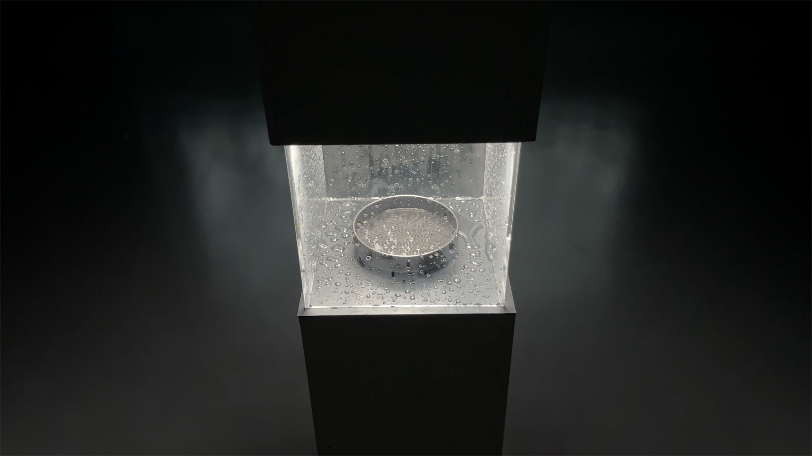

# Searching...

A cymatics installation in which an AI watches vibrating water and searches aloud for beauty.

Final project, MA Computational Arts, Goldsmiths. By Paul Calver.

Video: https://vimeo.com/1182923519



## Requirements

- TouchDesigner 2023+
- Python packages in TD's bundled Python: `opencv-python`, `Pillow`
- Anthropic API key (model: `claude-haiku-4-5-20251001`)
- Sony A7R V + 90mm macro, LED ring light, 3" 4Ω driver, PAM8406 amp, 15cm perspex cube, petri dish (10–20% glycerine/water).
- MDF plinth
- 1080p Projector

Install packages into TD's Python:

```bash
/Applications/TouchDesigner.app/Contents/Frameworks/Python.framework/Versions/3.11/bin/python3.11 -m pip install opencv-python Pillow
```

## Running it

1. Open `searching.toe`.
2. Add your Anthropic API key to `py/ai_assess_git.py` (line 14).
3. Update paths at the top of `py/ai_assess_git.py` to match your system.
4. Select the Sony A7R V in the Video Device In TOP.
5. Start the capture timer. The loop runs autonomously.


## Credits

Paul Calver, 2026 / pcalv001@gold.ac.uk

Anthropic's Claude (Opus 4.7) was used throughout development as a coding assistant. All design decisions and final code were reviewed and edited by the author.

**The committed `ai_assess_git.py` has no API key. Add your own before running.**
